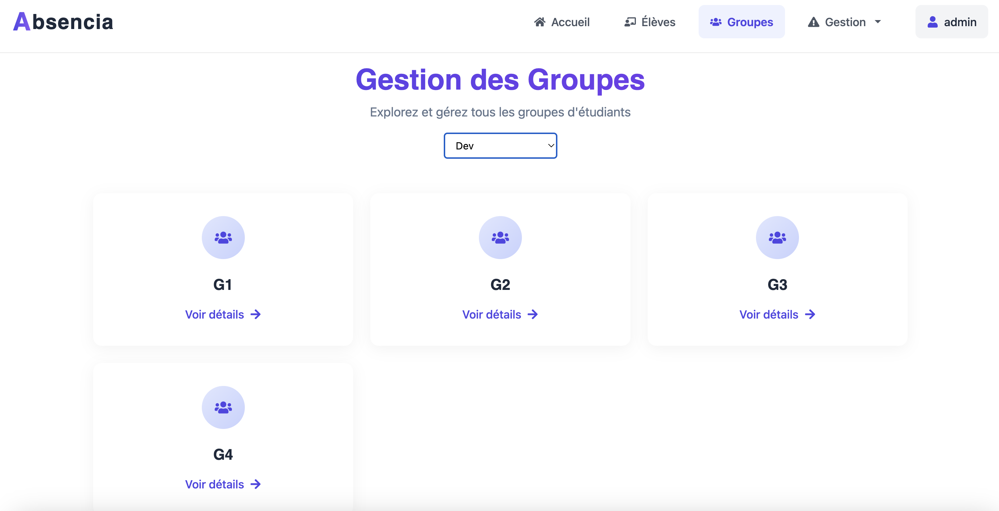

📘 Absencia

**Absencia** est une application web complète pour la **gestion des absences scolaires**. Elle permet de suivre les présences des élèves, de générer des rapports d’absences, et d’alerter automatiquement les parents en cas d’absences répétées.

## 🎯 Objectifs du projet

* Suivi des absences par matière, date et séance.
* Génération de rapports d’absences en PDF.
* Alerte automatique envoyée aux parents selon le nombre d’absences.
* Interface intuitive pour les administrateurs et enseignants.

## 🧰 Technologies utilisées


### 🔧 Backend

* [Django](https://www.djangoproject.com/)
* [Django REST Framework](https://www.django-rest-framework.org/)
* [Simple JWT](https://django-rest-framework-simplejwt.readthedocs.io/en/latest/) pour l’authentification

### 💻 Frontend

* [React.js](https://reactjs.org/)
* [Axios](https://axios-http.com/) pour les requêtes API
* [React Router](https://reactrouter.com/) pour la navigation

### 🗄️ Base de données

* SQLite (en développement)

## 🐳 Dockerisation

Ce projet est également **dockerisé**. Tu peux l’exécuter avec Docker pour simplifier l’installation et la configuration de l’environnement.

Nous utilisons des images Docker officielles pour :
- Le backend Django (basé sur l’image `python:3.10`)
- Le frontend React (basé sur l’image `node:18`)

### Exemple d’image Docker utilisée :


## 🧩 Fonctionnalités principales

* CRUD des étudiants, matières, groupes et filières
* Gestion des présences par élève et par séance
* Alertes automatiques en cas d’absence
* Génération et téléchargement des rapports en PDF
* Authentification par jeton JWT 

## 🚀 Installation

### 1. Cloner le dépôt

```bash
git clone https://github.com/Mouhlal/Absencia.git
cd Absencia
```

### 2. Backend (Django)

```bash
cd backend
python -m venv env
source venv/bin/activate  # ou venv\Scripts\activate sous Windows
pip install -r requirements.txt
python manage.py migrate
python manage.py runserver
```

### 3. Frontend (React)

```bash
cd frontend
npm install
npm start
```

## 📷 Aperçu





## 👨‍💻 Auteur

* Mouhlal Akram


